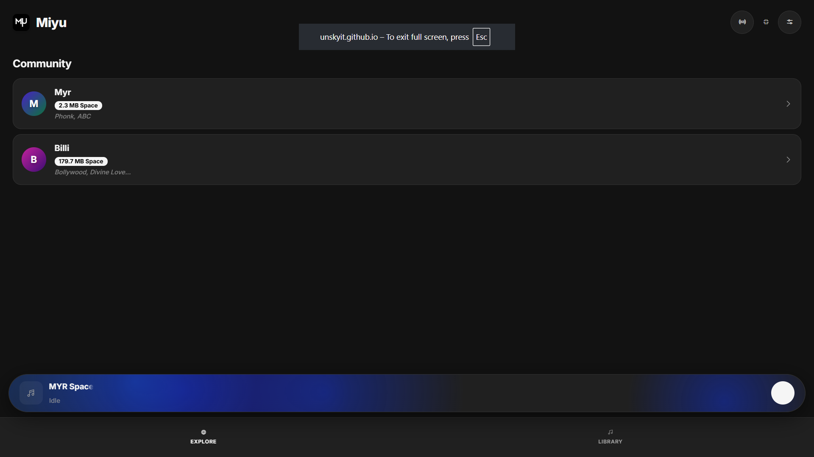
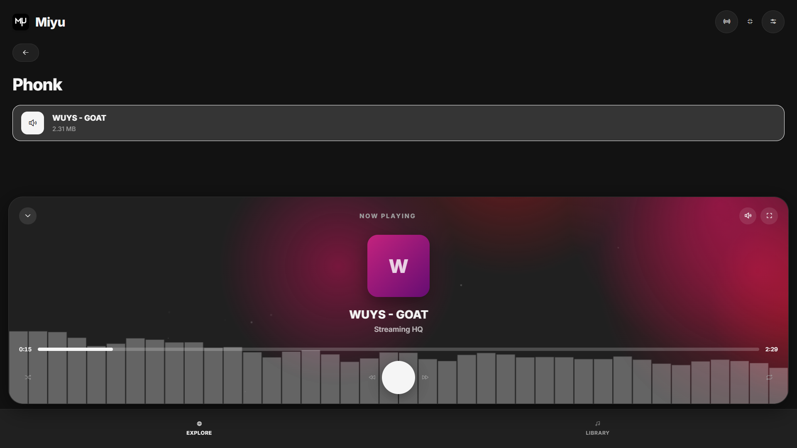

<div align="center">
  
  # 🎵 Miyu Space
  
  **A god-tier, zero-framework, personal music sanctuary.**
  
  [](https://developer.mozilla.org/en-US/docs/Web/HTML)
  [](https://developer.mozilla.org/en-US/docs/Web/CSS)
  [](https://developer.mozilla.org/en-US/docs/Web/JavaScript)
  [](https://supabase.com/)
  [](https://opensource.org/licenses/MIT)

  <br />
  
  <div align="center">
  
  
</div>

</div>

---

## 🌌 About Miyu

Miyu is an ultra-premium, single-page web application (SPA) designed to be your personal cloud music player. Built entirely without front-end frameworks, it achieves native-app performance and buttery-smooth animations using pure HTML, CSS, and Vanilla JavaScript, all backed by the raw power of Supabase. 

Miyu was designed with an "Apple-level polish + indie hacker simplicity" philosophy. It features a completely dynamic player, immersive beat-reactive visuals, and real-time remote playback synchronization.

## ✨ Key Features

### 🎧 The 3-Tier Dynamic Player
- **Mini-Pill:** A non-intrusive bottom bar for quick play/pause while browsing.
- **Expanded Hub:** A glassmorphic control center with volume, shuffle, loop, and seek controls.
- **Zen Mode (Immersive Fullscreen):** Hides all UI elements and text, turning your device into an edge-to-edge hypnotic light show.

### 🎨 Smart Beat-Reactive Visualizer
- A globally anchored HTML5 Canvas engine that reads audio frequencies in real-time.
- **Dynamic Emotion Mapping:** Calm tracks generate soothing deep blues and purples. Heavy beats and phonk trigger aggressive pinks and crimson reds.
- Features slow-drifting orbs, shooting dust embers, and flat, highly-calibrated EQ bars.

### 📡 "Listen Together" (Sync Engine)
- Powered by Supabase Realtime Broadcasts.
- Host a session to generate a 5-digit sync code.
- Anyone can join (even guests) to lock playback, pausing, and seeking seamlessly across devices anywhere in the world.

### 🗄️ Robust Library & Storage
- **Mass Uploads:** Stage up to 50 tracks at once, rename them locally, and push them to the cloud with real-time, byte-for-byte progress bars.
- **Collections:** Create, edit, and manage playlists. Playlist covers are mathematically generated beautiful gradients based on the playlist name.
- **Community Exploration:** Browse other users' public playlists and view their storage allocation. Raw tracks remain private; only playlist contents are public.

### 🔋 Pro-Level Optimizations
- **Offline Engine:** Toggleable native Cache API support. Cache your tracks directly to your device for zero-connectivity playback.
- **MediaSession API:** Lock-screen controls and dynamically generated cover art for iOS/Android control centers.
- **Keyboard Hotkeys:** `[Space]` to Play/Pause, `[Left/Right Arrows]` to seek.
- **3 Premium Themes:** AMOLED True Black, IPS Deep Gray, and Crisp Light mode.

---

## 🛠 Tech Stack

Miyu is a masterclass in modern web capabilities, strictly avoiding bloated frameworks:

- **Frontend:** Pure HTML5, CSS3 (Variables, Flex/Grid, Glassmorphism), Vanilla ES6+ JavaScript.
- **Audio/Visual:** HTML5 `<audio>`, Web Audio API (`AudioContext`, `AnalyserNode`), HTML5 `<canvas>`.
- **Backend Engine:** Supabase (PostgreSQL Database, Auth, Storage Buckets, Realtime Channels).
- **Icons:** Phosphor Icons.

---

## 📸 Showcase

<div align="center">
  
  
  
</div>

---

## 🚀 Getting Started

Because Miyu relies on absolutely zero build tools, deployment is as simple as launching a single file.

### 1. Supabase Setup
1. Create a free project on [Supabase](https://supabase.com/).
2. Run the following in your Supabase **SQL Editor** to create the schema:

```sql
-- Users Table
CREATE TABLE public.users (
  id UUID REFERENCES auth.users(id) PRIMARY KEY,
  handle TEXT UNIQUE NOT NULL,
  created_at TIMESTAMP WITH TIME ZONE DEFAULT timezone('utc'::text, now()) NOT NULL
);

-- Songs Table
CREATE TABLE public.songs (
  id UUID DEFAULT gen_random_uuid() PRIMARY KEY,
  user_id UUID REFERENCES public.users(id) NOT NULL,
  title TEXT NOT NULL,
  file_path TEXT NOT NULL,
  file_size BIGINT NOT NULL,
  created_at TIMESTAMP WITH TIME ZONE DEFAULT timezone('utc'::text, now()) NOT NULL
);

-- Playlists Table
CREATE TABLE public.playlists (
  id UUID DEFAULT gen_random_uuid() PRIMARY KEY,
  user_id UUID REFERENCES public.users(id) NOT NULL,
  name TEXT NOT NULL,
  description TEXT DEFAULT '',
  created_at TIMESTAMP WITH TIME ZONE DEFAULT timezone('utc'::text, now()) NOT NULL
);

-- Playlist_Songs join table (with cascading deletes)
CREATE TABLE public.playlist_songs (
  playlist_id UUID REFERENCES public.playlists(id) ON DELETE CASCADE,
  song_id UUID REFERENCES public.songs(id) ON DELETE CASCADE,
  added_at TIMESTAMP WITH TIME ZONE DEFAULT timezone('utc'::text, now()) NOT NULL,
  PRIMARY KEY (playlist_id, song_id)
);

-- Enable RLS
ALTER TABLE public.users ENABLE ROW LEVEL SECURITY;
ALTER TABLE public.songs ENABLE ROW LEVEL SECURITY;
ALTER TABLE public.playlists ENABLE ROW LEVEL SECURITY;
ALTER TABLE public.playlist_songs ENABLE ROW LEVEL SECURITY;

-- Set Public Read Access
CREATE POLICY "Public can view users" ON public.users FOR SELECT USING (true);
CREATE POLICY "Public can view songs" ON public.songs FOR SELECT USING (true);
CREATE POLICY "Public can view playlists" ON public.playlists FOR SELECT USING (true);
CREATE POLICY "Public can view playlist songs" ON public.playlist_songs FOR SELECT USING (true);

-- Authenticated Write Access
CREATE POLICY "Users can update own record" ON public.users FOR UPDATE TO authenticated USING (auth.uid() = id);
CREATE POLICY "Users can insert own songs" ON public.songs FOR INSERT TO authenticated WITH CHECK (auth.uid() = user_id);
CREATE POLICY "Users can delete own songs" ON public.songs FOR DELETE TO authenticated USING (auth.uid() = user_id);
CREATE POLICY "Users can manage own playlists" ON public.playlists FOR ALL TO authenticated USING (auth.uid() = user_id);
CREATE POLICY "Users can manage own playlist songs" ON public.playlist_songs FOR ALL TO authenticated USING (
  EXISTS (SELECT 1 FROM public.playlists WHERE id = playlist_id AND user_id = auth.uid())
);
